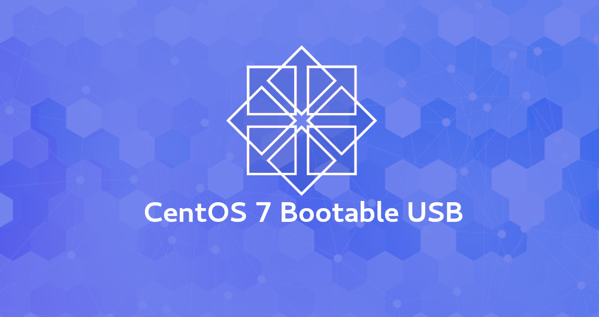

## Centos 7
The **C**ommunity **ENT**erprise **O**perating **S**ystem - Instalacija minimal

- Skinuti posljednju verziju s službenih stranica [CentOS ISO DVD](https://www.centos.org/download/) te prilikom instalacije izabrati minimal.
ili 
mirro s hrvatskih servera (Plus hosting) [ISO slika](http://mirror.centos.plus.hr/centos/7.7.1908/isos/x86_64/CentOS-7-x86_64-Minimal-1908.iso) u ISO formatu.

## Kreiranje USB bootable diska 
- Linux 
- Windows

### Instalacija
[Instalacija](instalacija/README.md)

Preuzimanje CentOS ISO datoteke

Preuzmite CentOS ISO datoteku sa stranice za [preuzimanje CentOS-a](https://www.centos.org/download/) na kojoj možete birati između "DVD ISO" i "Minimal ISO".

Minimalna instalacijska slika sadrži samo one pakete koji su potrebni za funkcioniranje CentOS sustava. DVD slika sadrži sve pakete koji se mogu instalirati pomoću alata za instalaciju.

Najvjerojatnije ćete htjeti preuzeti „DVD ISO“ verziju.

### Stvaranje Bootable CentOS 7 USB Stick-a na Linuxu

Iako postoji mnogo različitih GUI alata koji vam omogućuju flash ISO slike na USB pogonima, u ovom ćemo vodiču stvoriti pokretački CentOS 7 USB stick za pokretanje pomoću naredbe dd.

Stvaranje Bootable CentOS 7 USB Stick-a na Linuxu je brz i jednostavan proces, samo slijedite korake opisane u nastavku.

1. Umetnite USB fleš pogon u USB priključak.
2. Saznajte naziv USB pogona pomoću naredbe lsblk:
